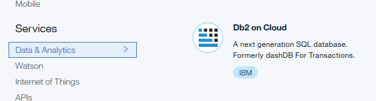
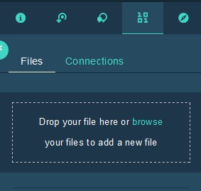
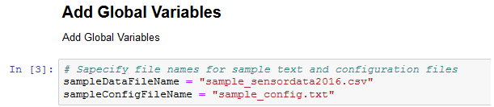

# Change Point Detection in Time Series Sensor data

This developer journey is intended for any Developer who wants to experiment, learn, enhance and implement a new method for detecting Change point in Sensor data. Sensors mounted on devices like IoT devices, Automated manufacturing like Robot arms, Process monitoring and Control equipment etc., collect and transmit data on a continuous basis which is Time stamped. 
This journey takes you through end to end flow of steps in collating statistics on such Time series data and identify if a Change point has occurred. Core building blocks would include computing Statistical parameters from the Time series data, which compares a Previous dataset of a certain Time range in the past with the Current Series in a recent Time range. Statistical comparison between these two results in detection of any change points. R statistical software is used in this Journey with sample Sensor data loaded into the Data Science experience cloud.
All the intermediary steps are modularized and all code open sourced to enable developers to use / modify the modules / sub-modules as they see fit for their specific application
When you have completed this journey, you will understand how to

* Create and Run a Jupyter Notebook in DSX
* Run R statistical software code in Jupyter Notebook
* Generate results in the form of visualisation plots
* Execute R statistical functions to detect Change point in data
* Output and save results in DSX Jupyter Notebook

1.	User logs into Data Science -> R Studio and selects the Sensor Time series data files in csv format from the local folder
2.	The documents stored in the local folder, will be uploaded to the cloud on which further processing will be applied
3.	User configures the parameters in R code flow to read the relevant subset from the Sensor data file
4.	Data from the cloud will be read by R Studio in Data Science Experience.
5.	The user will further extract the 2 series of datasets to be compared
6.	R Studio will use open R libraries and Custom built function components to get the statistics computed
7.	User will generate visual comparison charts to aid visualizing any hints for changes in behavior of the sensor
8.	These Statistical metrics will be compared and the changes analyzed using the Custom functions written in R
9.	Based on the threshold deviation specified by the user, Custom R functions will then output if there is a Change point occurrence detected
10.	Due to the reusable nature of the components, innumerable combination of data sets can be quickly compared for change point occurrence

Developer can reuse all components that support the above steps like
1.	Reading specific Time series data points from a csv file like Time stamp, Sensor ID, Sensor values
2.	Time stamp conversion functions, filtering data for specific sensor
3.	User configurable Time ranges for Splitting Time series data into 2 sets for comparison
4.	Computations of key statistics that statistically compresses these series for useful comparison
5.	Build a dictionary of statistics to consistently compare these data sets
6.	Based on threshold specified by User, detect if a Change point has occurred in the data

## Included components

* [IBM Data Science Experience](https://www.ibm.com/bs-en/marketplace/data-science-experience): Analyze data using RStudio, Jupyter, and Python in a configured, collaborative environment that includes IBM value-adds, such as managed Spark.

* [Bluemix Object Storage](https://console.ng.bluemix.net/catalog/services/object-storage/?cm_sp=dw-bluemix-_-code-_-devcenter): A Bluemix service that provides an unstructured cloud data store to build and deliver cost effective apps and services with high reliability and fast speed to market.

## Featured technologies

* [Jupyter Notebooks](http://jupyter.org/): An open-source web application that allows you to create and share documents that contain live code, equations, visualizations and explanatory text.

# Watch the Video

# Steps

Follow these steps to setup and run this developer journey. The steps are
described in detail below.

1. [Sign up for the Data Science Experience](#1-sign-up-for-the-data-science-experience)
1. [Create Bluemix services](#2-create-bluemix-services)
1. [Create the notebook](#3-create-the-notebook)
1. [Add the data and configuraton file](#4-add-the-data-config-file)
1. [Update the notebook with service credentials](#5-update-the-notebook-service-credential)
1. [Run the notebook](#6-run-the-notebook)
1. [Download the results](#7-download-the-results)

## 1. Sign up for the Data Science Experience

Sign up for IBM's [Data Science Experience](http://datascience.ibm.com/). By signing up for the Data Science Experience, two services: ``DSX-Spark`` and ``DSX-ObjectStore`` will be created in your Bluemix account.

## 2. Create Bluemix services

Create the following Bluemix service by following the link to use the Bluemix UI and create it.

  * [**Data Science Experience**](https://console.bluemix.net/catalog/services/data-science-experience)

  
  

  * [**Getting started with dash DB for Analytics**](https://www.youtube.com/watch?v=CMFo4EtQ_ao)
  * [**dash DB for Analytics**](https://www.youtube.com/watch?v=CMFo4EtQ_ao)

    
 
  
## 3. Create the notebook

Use the menu on the left to select `My Projects` and then `Default Project`.
Click on `Add notebooks` (upper right) to create a notebook.

* Select the `From URL` tab.
* Enter a name for the notebook.
* Optionally, enter a description for the notebook.
* Enter this Notebook URL: https://github.com/dkprabu/changepoint1/blob/master/notebooks/watson_changepoint_detection.ipynb
* Click the `Create Notebook` button.

## 4. Add the data and configuration file

#### Add the data and configuration to the notebook
Use `Find and Add Data` (look for the `10/01` icon)
and its `Files` tab. From there you can click
`browse` and add data and configuration files from your computer.

> Note:  If you don't have your own data and configuration files, you can get our example by cloning
this git repo. Look in the `data/sample_sensordata2016.csv` directory for data file and in the `configuration/sample_config.txt`.
If you use configuration file from your computer, make sure to conform to the JSON structure given in `configuration/sample_config.txt`.

#### Fix-up variable names
Once the files have been uploaded into ``DSX-ObjectStore`` you need to update the variables that refer to the data and configuration files in the Jupyter Notebook.

In the notebook, update the global variables the in cell following `2.3 Global Variables` section.

Replace the `sampleDataFileName` with the name of the data file and `sampleConfigFileName` with the configuration file name.

## 5. Run the notebook

When a notebook is executed, what is actually happening is that each code cell in
the notebook is executed, in order, from top to bottom.

Each code cell is selectable and is preceded by a tag in the left margin. The tag
format is `In [x]:`. Depending on the state of the notebook, the `x` can be:

* A blank, this indicates that the cell has never been executed.
* A number, this number represents the relative order this code step was executed.
* A `*`, this indicates that the cell is currently executing.

There are several ways to execute the code cells in your notebook:

* One cell at a time.
  * Select the cell, and then press the `Play` button in the toolbar.
* Batch mode, in sequential order.
  * From the `Cell` menu bar, there are several options available. For example, you
    can `Run All` cells in your notebook, or you can `Run All Below`, that will
    start executing from the first cell under the currently selected cell, and then
    continue executing all cells that follow.
* At a scheduled time.
  * Press the `Schedule` button located in the top right section of your notebook
    panel. Here you can schedule your notebook to be executed once at some future
    time, or repeatedly at your specified interval.

## 6. View the results

The notebook outputs the results in the Notebook which can be copied to clipboard

# Troubleshooting

[See DEBUGGING.md.](DEBUGGING.md)

# License

[Apache 2.0](LICENSE)
